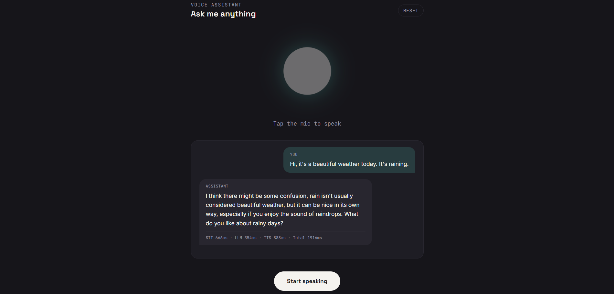
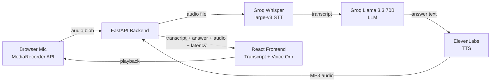

# LLM-VoiceBot: Voice LLM Assistant

A real-time, voice-in-voice-out AI assistant. Speak a question, get a spoken answer back — with live latency
breakdown, conversation memory, and a UI that visually reflects pipeline state.

Built end-to-end (mic capture → STT → LLM → TTS → playback) in under a week as a demo project.

---

## Demo

<p align="center">
  
</p>

## Architecture



**Flow:**
1. Browser records your voice using the native `MediaRecorder` API — no extra library needed.
2. The audio blob is sent to a FastAPI backend over a single REST call.
3. **Speech-to-text**: Groq's hosted Whisper (`whisper-large-v3`) transcribes it.
4. **LLM**: the transcript, plus recent conversation history, goes to Groq's Llama 3.3 70B.
5. **Text-to-speech**: the answer is synthesized into audio via ElevenLabs.
6. The backend returns transcript, answer text, base64-encoded audio, and a per-stage latency breakdown —
   all in one response.
7. The frontend plays the audio, updates the transcript, and drives the voice orb's animation based on
   pipeline state (idle / listening / processing / speaking).

---

## Features

- **Full voice loop** — speak a question, hear a spoken answer, no typing required
- **Conversation memory** — the assistant remembers prior turns within a session (ask follow-up questions naturally)
- **Live latency breakdown** — every response shows STT / LLM / TTS / total time, so the pipeline's performance is visible, not just claimed
- **Stateful voice orb UI** — a central animated element whose color and motion directly reflect what the pipeline is doing (cyan pulse = listening, amber flicker = speaking)
- **Session reset** — clear conversation memory and start fresh with one click

---

## Tech Stack

| Layer | Choice |
|---|---|
| Frontend | React + TypeScript + Tailwind CSS |
| Audio capture | Browser-native MediaRecorder API |
| Backend | FastAPI (Python 3.11+) |
| Speech-to-Text | Groq API — Whisper large-v3 |
| LLM | Groq API — Llama 3.3 70B |
| Text-to-Speech | ElevenLabs API |
| Conversation memory | Plain in-memory Python data structure |
| Env/config | python-dotenv |

---

## Design Decisions

A few choices here were deliberate trade-offs, not just "the first thing that worked" — worth calling out
since they reflect how the system was reasoned about, not just assembled.

**Groq for both STT and LLM, not two different providers.**
Latency is the core UX problem in a voice interface — a slow response breaks the conversational feel
immediately. Groq's inference speed (via their LPU hardware) is a major factor in keeping the loop feeling
responsive, which is why both the transcription and the language model call go through Groq rather than
mixing providers. It also means one API key and one failure mode to reason about instead of two.

**Plain Python list for conversation memory, not LangChain.**
LangChain is a legitimate tool for complex multi-tool agent orchestration, but for a linear
STT → LLM → TTS pipeline it adds an abstraction layer and dependency surface with no functional benefit here.
A list of `{role, content}` turns, capped to the last N exchanges, *is* a complete memory implementation for
this use case — and it's fully transparent: every line of the memory logic is visible and explainable,
nothing is hidden behind a framework.

**REST, not WebSockets, for audio transfer.**
Streaming audio over WebSockets would reduce perceived latency further, but adds real complexity (connection
lifecycle, partial-audio handling, reconnection logic) for a marginal gain at this stage. Recording the full
clip and sending it as one request is simpler to reason about, easier to debug, and the latency numbers in
the UI show it's still fast enough to feel conversational. This is the clearest candidate for a "next
iteration" upgrade — see below.

**Local-only, not deployed.**
Deploying to Vercel/Render adds CORS configuration, environment variable duplication across two platforms,
and free-tier cold-start delays that actively hurt a live demo. Running locally removes an entire class of
failure modes for a one-time presentation, at the cost of not having a public URL.

---

## What I'd Add With More Time

- **Streaming responses** — start playing TTS audio as soon as the first sentence is ready, instead of
  waiting for the full LLM response, using WebSockets or server-sent events
- **Interruption handling ("barge-in")** — let the user start speaking while the assistant is still talking,
  the way real voice assistants do
- **Voice activity detection** — auto-stop recording on silence instead of requiring a manual "stop" click
- **Persistent memory** — swap the in-memory dict for Redis or a lightweight DB so conversations survive a
  server restart
- **Deployment** — containerize with Docker and deploy both services, with proper CORS lockdown and secrets
  management

---

## Setup

See [`voice-llm-backend/README.md`](./voice-llm-backend/README.md) and
[`voice-llm-frontend/README.md`](./voice-llm-frontend/README.md) for detailed setup steps for each service.

Quick version:

```bash
# Backend (terminal 1)
cd voice-llm-backend
python3 -m venv venv && source venv/bin/activate  # Windows: venv\Scripts\activate
pip install -r requirements.txt
cp .env.example .env   # then add your GROQ_API_KEY and ELEVENLABS_API_KEY
uvicorn main:app --reload --port 8000

# Frontend (terminal 2)
cd voice-llm-frontend
npm install
npm run dev
```

Open `http://localhost:5173`, click **Start speaking**, and talk.

---

## Project Structure

```
Voice-LLM/
├── voice-llm-backend/
│   ├── main.py              # FastAPI app: STT -> LLM -> TTS pipeline, timing, memory
│   ├── requirements.txt
│   ├── .env.example
│   └── README.md
│
└── voice-llm-frontend/
    ├── src/
    │   ├── App.tsx           # Voice orb, mic recording, transcript, latency display
    │   ├── lib/api.ts        # Backend API client
    │   ├── index.css         # Tailwind + orb animations
    │   └── main.tsx
    ├── package.json
    └── README.md
```